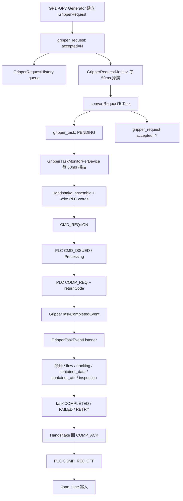

# GripperRequest 資料流規格

## 範圍

本文件描述 `GripperRequest` 從生成、轉成 `GripperTask`、送 PLC、收到完成回報、更新帳籍，到任務真正結束的完整資料流。

## 主要生命週期

## 1. Request 生成

入口介面：

- `src/main/java/com/czkuo/rdf88701/application/generator/GripperRequestGenerator.java`
- `src/main/java/com/czkuo/rdf88701/application/generator/impl/gripper/GP1RequestGenerator.java`
- `src/main/java/com/czkuo/rdf88701/application/generator/impl/gripper/GP2RequestGenerator.java`
- `src/main/java/com/czkuo/rdf88701/application/generator/impl/gripper/GP3RequestGenerator.java`
- `src/main/java/com/czkuo/rdf88701/application/generator/impl/gripper/GP4RequestGenerator.java`
- `src/main/java/com/czkuo/rdf88701/application/generator/impl/gripper/GP5RequestGenerator.java`
- `src/main/java/com/czkuo/rdf88701/application/generator/impl/gripper/GP6RequestGenerator.java`
- `src/main/java/com/czkuo/rdf88701/application/generator/impl/gripper/GP7RequestGenerator.java`

Generator 判斷條件包含：

- Gripper 是否已有未完成 request/task。
- 來源或目標位置是否有容器。
- IR / WB / TR / OCR 是否互斥。
- 是否需要先建立紅外線量測 request。
- 應建立 `MOVE`、`PICK` 或 `DROP`。

成功後寫入：

- `gripper_request`
- `gripper_request_history` queue

## 2. Generator 排程來源

`GP2 / GP4 / GP5` 由群組 orchestrator 執行：

- `src/main/java/com/czkuo/rdf88701/application/monitor/DualGroupOrchestrator.java`

其他 Gripper generator 由一般 launcher 執行：

- `src/main/java/com/czkuo/rdf88701/application/monitor/GripperMonitorLauncher.java`

兩者皆以短週期輪詢方式呼叫 `generateRequest(gripperId)`。

## 3. Request 轉 Task

排程入口：

- `src/main/java/com/czkuo/rdf88701/application/monitor/GripperRequestMonitor.java`
- `src/main/java/com/czkuo/rdf88701/application/service/GripperRequestMonitorService.java`

轉換服務：

- `src/main/java/com/czkuo/rdf88701/application/service/command/GripperRequestCommandService.java`
- `src/main/java/com/czkuo/rdf88701/domain/factory/GripperTaskFactory.java`

轉換規則：

- 每台 Gripper 每輪只取最早一筆 `accepted = 'N'`。
- 建立 `gripper_task`，初始 `task_status = PENDING`。
- 將 `gripper_request.accepted` 改為 `Y`。
- request/task 更新都會進 history queue。

## 4. Task 送 PLC

排程入口：

- `src/main/java/com/czkuo/rdf88701/application/monitor/GripperTaskMonitorLauncher.java`
- `src/main/java/com/czkuo/rdf88701/application/monitor/GripperTaskMonitorPerDevice.java`

Task 查詢條件：

- `task_status IN ('PENDING', 'DISPATCHED', 'IN_PROGRESS', 'RETRY', 'COMPLETED', 'FAILED')`
- `done_time IS NULL`

因此 `COMPLETED` / `FAILED` 仍可能被 monitor 撿起，直到 handshake 收尾寫入 `done_time`。

PLC command 組裝：

- `src/main/java/com/czkuo/rdf88701/application/assembler/GripperWordCommandAssembler.java`

寫入內容包含：

- `transferNo = gripper_task.id`
- `commandType = MOVE/PICK/DROP`
- `trayQuantity = layer_count`
- `trayHeight = target_height_mm * 100`
- `locationLevel`
- `productId = container aliasCode`

## 5. PLC Handshake

核心：

- `src/main/java/com/czkuo/rdf88701/application/service/command/GripperHandshakeStateMachine.java`
- `src/main/java/com/czkuo/rdf88701/application/service/command/DefaultGripperHandshakeStrategy.java`

狀態階段：

- `NONE`
- `CMD_SENT`
- `ACK_RECEIVED`
- `CMD_REQ_CLEARED`
- `IN_PROGRESS`
- `COMPLETION_RECEIVED`
- `RESPONDED_COMPLETION`
- `COMPLETION_CONFIRMED`
- `DONE`
- `FAILED`

重要狀態變化：

- command 寫入後，task 標為 `DISPATCHED`。
- PLC ACK 後，task 標為 `IN_PROGRESS`。
- PLC completion request 後，發布 `GripperTaskCompletedEvent`。
- PLC 放掉 completion request 後，才寫入 `done_time`。

## 6. PLC 狀態來源

PLC polling：

- `src/main/java/com/czkuo/rdf88701/application/service/polling/handler/GripperPollingHandler.java`

資料處理：

- PLC read bit/word 合併成 `GripperDeviceStatus`。
- PLC write bit/word 回讀合併成 `GripperCommandStatus`。
- bit/word snapshot 差距需小於 100ms。
- 狀態放入 `GripperStatusCache` / `GripperCommandCache`。

Handshake 使用這兩個 cache 判斷下一步。

## 7. 完成事件處理

事件 listener：

- `src/main/java/com/czkuo/rdf88701/application/listener/GripperTaskEventListener.java`

return code 對應：

- `0x100`：成功，先更新帳籍，再標 `COMPLETED`。
- `0x800`：任務中斷，標 `FAILED`。
- `0xF00`：任務異常，標 `FAILED`。
- 其他：標 `RETRY`。

成功帳籍處理：

- `src/main/java/com/czkuo/rdf88701/application/service/transfer/GripperTaskTransferService.java`

## 8. 成功後衍生資料

`MOVE`：

- 目前無帳籍處理。

`PICK` 可能更新或建立：

- `location_flow`
- `location_tracking`
- `container_data`
- `container_main`
- `container_attr`
- `inspection_job`
- `gripper_task.container_main_id`

`DROP` 可能更新：

- `location_flow`
- `location_tracking`
- `container_data`
- `container_attr`

常見 helper：

- `markPreviousAsLeftAndVacant`
- `markPreviousAsLeftOnGripperOnly`
- `markArrived`
- `writeBreakdown`
- `bindLineage`
- `copyR029Context`
- `copyOcrText`
- `ensureGroupsAttrFromName`
- `propagateGroupsAttr`
- `mirrorSeqTo`
- `maybeCreateInspectionJobAndBind`
- `linkToInspectionIfAny`
- `normalizeDropTarget`

## 9. History 落地

History 不是全部即時寫入 history table，而是先進 queue。

Flush monitor：

- `src/main/java/com/czkuo/rdf88701/application/monitor/History/HistoryFlushMonitor.java`

Flush 規則：

- 每 20 秒執行。
- 每類型最多 poll 50 筆。
- 寫入對應 history table。

## 結束判斷

`gripper_request.accepted = Y`：

- 代表 request 已轉成 task。

`gripper_task.task_status = COMPLETED / FAILED`：

- 代表 PLC return code 已被業務層處理。

`gripper_task.done_time IS NOT NULL`：

- 代表 handshake 已完成收尾。
- 這才是 Gripper task 的真正結束點。
