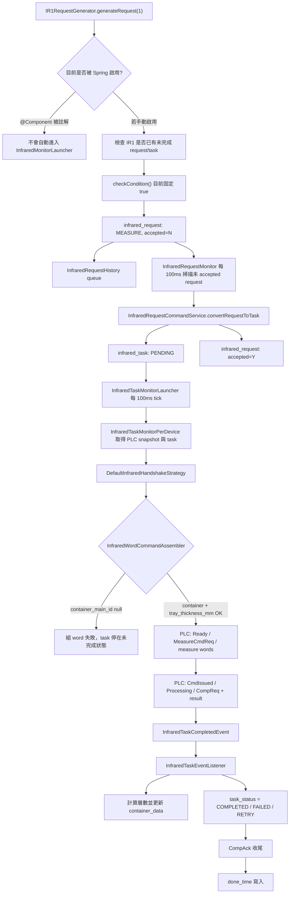

# IR1RequestGenerator 完整生命週期規格

## 目的

本文件整理 `IR1RequestGenerator` 產生 `InfraredRequest` 後，資料如何轉換成 `InfraredTask`、進入 PLC handshake、接收量測結果、更新 `container_data`，最後寫入 history 並結束。

本文件特別標出 IR1 目前的實際狀態：

- `IR1RequestGenerator` 的 `@Component("IR1")` 目前被註解，因此預設不會被 Spring 放入 generator map。
- `InfraredMonitorLauncher.launchAllMonitors()` 的 `@PostConstruct` 目前也被註解，因此 Infrared request 自動產生排程沒有啟動。
- IR1Generator 建立 request 時沒有設定 `container_main_id`。
- 後續 `InfraredWordCommandAssembler` 要求 `container_main_id` 不可為 null，且必須讀到 `container_attr.tray_thickness_mm`。

因此，以目前程式狀態，IR1Generator 這條路徑即使被手動啟用，也會在送 PLC 組 word 時因缺少 container 而中斷。能正常送 PLC 的 Infrared request 通常需要走有帶 `container_main_id` 的建立入口，例如 `InfraredRequestRepositoryImpl.createMeasureRequestForContainer(...)`。

## 總覽流程



## 1. IR1 Request 產生

主要檔案：

- `src/main/java/com/czkuo/rdf88701/application/generator/impl/infrared/IR1RequestGenerator.java`
- `src/main/java/com/czkuo/rdf88701/application/generator/InfraredRequestGenerator.java`

IR1Generator 目前內容：

- `@Component("IR1")` 被註解。
- `checkCondition(infraredId)` 目前固定回傳 `true`。
- 建立 `InfraredRequest` 時直接 new entity，不透過 `InfraredRequestCommandService`。
- request 欄位：
  - `requestKey = UUID.randomUUID().toString()`
  - `version = 1`
  - `requestSource = SYSTEM`
  - `infraredId = infraredId`
  - `taskType = MEASURE`
  - `accepted = N`
  - `requestTime = now`
  - `createdTime = now`
- 沒有設定：
  - `containerMainId`
  - `operator`
  - `updatedTime`
  - `remark`
  - `rawPayload`

產生前檢查：

- `requestRepository.existsUnfinishedRequestForInfrared(infraredId)`
- `taskRepository.existsUnfinishedTaskForInfrared(infraredId)`

只要 IR1 有尚未 accepted 的 request，或有未完成 task，就不建立新 request。

## 2. Infrared 自動產生排程

主要檔案：

- `src/main/java/com/czkuo/rdf88701/application/monitor/InfraredMonitorLauncher.java`

預期設計：

- 啟動時讀取所有 `infrared`。
- 依 `IR{id}` 從 Spring `generatorMap` 取得 generator。
- 每台 Infrared 使用 `scheduleWithFixedDelay(..., 100ms)`。
- 用 `runningFlags` 避免同台 Infrared 重入。
- 送入 `MonitorPoolDispatcher` 執行。
- 若 `infrared.enabled != true` 則跳過。

目前實際狀態：

- `launchAllMonitors()` 上的 `@PostConstruct` 被註解。
- 因此 Infrared request 自動產生排程不會啟動。
- 即使打開 `@PostConstruct`，IR1Generator 也因 `@Component("IR1")` 被註解，不會出現在 `generatorMap`。

## 3. Request 建立與資料表

DDL：

- `DDL/rdf887_01/infrared_request.sql`

重要欄位：

- `request_key`：唯一鍵。
- `request_source`：`UI` 或 `SYSTEM`。
- `infrared_id`：目標 Infrared。
- `container_main_id`：量測容器，可為 null，但送 PLC 前實務上必須有值。
- `task_type`：目前只有 `MEASURE`。
- `accepted`：預設 `N`。
- `accept_time`：轉成 task 時寫入。

IR1Generator 寫入後：

- `InfraredRequestRepositoryImpl.save()` 寫入 `infrared_request`。
- 成功後將 INSERT event 放入 `InfraredRequestHistoryInsertService` queue。

另一個可帶 container 的入口：

- `InfraredRequestRepositoryImpl.createMeasureRequestForContainer(Long containerMainId, Long infraredId)`

此入口會設定：

- `containerMainId`
- `infraredId`
- `taskType = MEASURE`
- `accepted = N`

這條路徑較符合後續 PLC assembler 的要求。

## 4. Request 轉 Task

排程入口：

- `src/main/java/com/czkuo/rdf88701/application/monitor/InfraredRequestMonitor.java`

服務：

- `src/main/java/com/czkuo/rdf88701/application/service/InfraredRequestMonitorService.java`
- `src/main/java/com/czkuo/rdf88701/application/service/command/InfraredRequestCommandService.java`
- `src/main/java/com/czkuo/rdf88701/domain/factory/InfraredTaskFactory.java`

流程：

1. `InfraredRequestMonitor` 每 100ms 讀取所有 Infrared id。
2. 每台 Infrared 丟入 dispatcher。
3. `monitorUnacceptedRequestsByDevice(Long infraredId)` 查詢該 Infrared 第一筆 `accepted = 'N'` request。
4. `convertRequestToTask(requestId, infraredId)` 重新讀取 request。
5. `validateForConvertToTask()` 確認 request 尚未 accepted 且未 rejected。
6. `InfraredTaskFactory.createFromRequest()` 建立 task。
7. 寫入 `infrared_task`，狀態為 `PENDING`。
8. `request.markAsAccepted()`，將 request 設為 `accepted = 'Y'` 並寫入 `accept_time`。
9. request/task 更新都會進入 history queue。

`InfraredTaskFactory.createFromRequest()` 欄位對應：

- `request.id` -> `task.request_id`
- `request.infrared_id` -> `task.infrared_id`
- `request.container_main_id` -> `task.container_main_id`
- `request.task_type` -> `task.task_type`
- `task_status = PENDING`
- `priority_level = 0`

## 5. Task 查詢與執行入口

排程入口：

- `src/main/java/com/czkuo/rdf88701/application/monitor/InfraredTaskMonitorLauncher.java`
- `src/main/java/com/czkuo/rdf88701/application/monitor/InfraredTaskMonitorPerDevice.java`

查詢服務：

- `src/main/java/com/czkuo/rdf88701/application/service/query/InfraredTaskQueryService.java`
- `src/main/java/com/czkuo/rdf88701/infra/repository/impl/InfraredTaskRepositoryImpl.java`
- `src/main/resources/mapper/InfraredTaskMapper.xml`

排程行為：

- 每台 Infrared 每 100ms tick。
- 用 `runningFlags` 防止同台 Infrared 重入。
- 實際執行送入 `MonitorPoolDispatcher`。
- 若 `InfraredStatusCache` 沒有有效且完整的 PLC snapshot，直接跳過。

Task 選取條件：

```sql
WHERE infrared_id = #{infraredId}
  AND task_status IN ('PENDING', 'DISPATCHED', 'IN_PROGRESS', 'RETRY', 'COMPLETED', 'FAILED')
  AND done_time IS NULL
ORDER BY
  CASE task_status
    WHEN 'PENDING' THEN 0
    WHEN 'DISPATCHED' THEN 1
    WHEN 'IN_PROGRESS' THEN 2
    WHEN 'RETRY' THEN 3
    WHEN 'COMPLETED' THEN 4
    WHEN 'FAILED' THEN 5
    ELSE 99
  END,
  priority_level DESC,
  id ASC
LIMIT 1
```

關鍵判斷：

- `COMPLETED` / `FAILED` 仍可能被查到，只要 `done_time IS NULL`。
- 這是為了讓 handshake 做 completion ack 收尾。
- 真正結束依據是 `done_time IS NOT NULL`。

## 6. PLC Command 組裝

主要檔案：

- `src/main/java/com/czkuo/rdf88701/application/assembler/InfraredWordCommandAssembler.java`
- `src/main/java/com/czkuo/rdf88701/application/assembler/PlcInfraredWordCommand.java`

組裝輸出：

- `measureNo = infrared_task.id`
- `taskType = 1`，代表 `MEASURE`
- `trayThickness = tray_thickness_mm * 100`

必要條件：

- `infrared_task.container_main_id` 不可為 null。
- `container_attr` 必須存在：
  - `container_main_id = task.containerMainId`
  - `attr_key = tray_thickness_mm`
- `tray_thickness_mm` 必須可解析為正數。
- 乘以 100 後必須落在 `0..65535`。

IR1 現況阻斷點：

- IR1Generator 建立 request 時沒有設定 `container_main_id`。
- request 轉 task 後，task 的 `container_main_id` 仍為 null。
- `InfraredWordCommandAssembler.assemble()` 會丟出 `IllegalStateException`。
- exception 由 `InfraredTaskMonitorPerDevice` catch 並記 log。
- task 狀態不會進入 `DISPATCHED`，也不會寫 `done_time`。
- 因為 task 仍是未完成狀態，後續 `existsUnfinishedTaskForInfrared()` 會阻止 IR1 再產生新 request。

## 7. PLC Handshake

主要檔案：

- `src/main/java/com/czkuo/rdf88701/application/service/command/InfraredHandshakeStateMachine.java`
- `src/main/java/com/czkuo/rdf88701/application/service/command/DefaultInfraredHandshakeStrategy.java`
- `src/main/java/com/czkuo/rdf88701/domain/repository/InfraredHandshakeContextRepository.java`

狀態階段：

- `NONE`
- `CMD_SENT`
- `ACK_RECEIVED`
- `CMD_REQ_CLEARED`
- `IN_PROGRESS`
- `COMPLETION_RECEIVED`
- `RESPONDED_COMPLETION`
- `COMPLETION_CONFIRMED`
- `DONE`
- `FAILED`

主要轉移：

1. 每次 tick 先寫 `InfraredReady = true`。
2. `NONE` 階段會先判斷 PLC 是否已有 ack、completion ack、processing 或 completion request。
3. 若沒有既有狀態，必須等 PLC 處於 Wait CMD：
   - `status.isInfraredStandby()`
   - `deviceStatusCode == 2`
   - `!status.isMeasureCmdAck()`
   - `!status.isAbnormal()`
4. 符合 Wait CMD 後，組 word 並寫入 PLC。
5. 寫 `MeasureCmdReq = true`。
6. task 標 `DISPATCHED`。
7. PLC `MeasureCmdIssued` 後關閉 `MeasureCmdReq`。
8. 進入 `IN_PROGRESS` 時 task 標 `IN_PROGRESS`。
9. PLC `MeasureCompReq` 後讀取量測結果與 return code。
10. 發出 `InfraredTaskCompletedEvent`。
11. 寫 `MeasureCompAck = true`。
12. PLC `MeasureCompReq` 關閉後，將 `MeasureCompAck = false`。
13. 若 task 已是 terminal 狀態，寫入 `done_time`。
14. phase 進入 `DONE`。

timeout 行為：

- `CMD_SENT` 超過 30 秒未 ack：
  - 關閉 `MeasureCmdReq`。
  - 若 PLC 仍是 Wait CMD，重送 command 並重置 timeout。
  - 若 PLC 不是 Wait CMD，phase 回 `NONE`。
- `IN_PROGRESS` 超過 300 秒未 completion：
  - 關閉 `MeasureCompAck`。
  - phase 回 `NONE`。

## 8. Completion Event 與結果資料

事件：

- `src/main/java/com/czkuo/rdf88701/infra/event/model/plc/infrared/InfraredTaskCompletedEvent.java`

Listener：

- `src/main/java/com/czkuo/rdf88701/application/listener/InfraredTaskEventListener.java`

event 內含：

- `task`
- `productHeight1`
- `productHeight2`
- `productQuantity`
- `retCode`
- `description`

return code 對應：

- `0x100`：量測成功，計算層數並更新 container data。
- `0x800`：任務中斷，task 標 `FAILED`。
- `0xF00`：量測異常，task 標 `FAILED`。
- 其他：task 標 `RETRY`。

注意：

- `RETRY` 不是 terminal 狀態。
- `COMPLETION_CONFIRMED` 階段遇到 `RETRY` 不會寫 `done_time`，而是回到 `NONE` 等下一輪重送。

## 9. 成功後層數計算與 container_data 更新

主要資料來源：

- PLC：
  - `productHeight1`
  - `productHeight2`
  - `productQuantity`
- DB：
  - `infrared_task.container_main_id`
  - `container_attr.tray_thickness_mm`
  - `location_tracking`
  - `location_point`
  - `container_data`

計算常數：

- `GAP_PER_LAYER = 0.06`
- `LAYER_TOLERANCE = 2.0`
- `CAMERA_TOLERANCE = 2.5`
- `CENTER_BIAS = 1.0`
- `CENTER_THRESHOLD_RATIO = 0.8`

處理流程：

1. 將 PLC 高度從 centi-mm 轉為 mm：
   - `height1 = productHeight1 / 100.0`
   - `height2 = productHeight2 / 100.0`
2. 讀取 `tray_thickness_mm`。
3. 若 `height1` 與 `height2` 差值大於 `CAMERA_TOLERANCE`：
   - task 標 `FAILED`
   - 不更新 container_data
4. 計算平均高度 `avg`。
5. 用厚度與 gap 推估 `estimatedLayer`。
6. 在容忍範圍內找出 `finalLayer`。
7. 若 `retCode = 0x100` 且 `finalLayer != -1`：
   - task 標 `COMPLETED`
   - 若 `container_main_id` 為 null，只記 log 並返回，不更新 container_data
   - 依 location 推導 `contentKind`
   - upsert `container_data`
   - 填補 cover/product layers
8. 若 `finalLayer = -1`：
   - task 標 `FAILED`

`contentKind` 推導：

- 若 container 目前位置為 `Site#12` 或 `Site#14`：
  - `ALL_COVER`
- 若 container 目前位置為 `Site#24` 或 `Site#35`：
  - `NORMAL_WITH_COVER`
- 其他：
  - `UNKNOWN`

container_data 更新：

- `estimated_quantity = finalLayer`
- `verified_quantity = finalLayer`
- `content_kind = contentKind`
- `ocr_text` 不變
- 之後呼叫 `fillLayersByKindIfUnset(containerMainId)` 補 cover/product layers。

## 10. History 生命週期

相關檔案：

- `src/main/java/com/czkuo/rdf88701/application/service/History/GenericHistoryInsertService.java`
- `src/main/java/com/czkuo/rdf88701/application/service/History/InfraredRequestHistoryInsertService.java`
- `src/main/java/com/czkuo/rdf88701/application/service/History/InfraredTaskHistoryInsertService.java`
- `src/main/java/com/czkuo/rdf88701/application/monitor/History/HistoryFlushMonitor.java`

觸發點：

- `InfraredRequestRepositoryImpl.save/update/deleteById`
- `InfraredTaskRepositoryImpl.save/update/deleteById/updateTaskStatus/markTaskAsDone`

處理方式：

- repository 不直接 insert history table。
- 先將 entity 與 changeType 放入 `ConcurrentLinkedQueue`。
- `HistoryFlushMonitor` 每 20 秒 flush。
- 每類一次 poll 50 筆。
- 目前 `InfraredRequestHistory` 與 `InfraredTaskHistory` 使用逐筆 insert。

## 11. 資料表與索引

DDL：

- `DDL/rdf887_01/infrared_request.sql`
- `DDL/rdf887_01/infrared_task.sql`
- `DDL/rdf887_01/infrared_request_history.sql`
- `DDL/rdf887_01/infrared_task_history.sql`

`infrared_request` 主要索引：

- `uk_request_key`：避免重複 request key。
- `IDX_infrared_request_accepted_created_time`
- `IDX_infrared_request_created_time`
- `idx_container_main_id`
- `idx_infrared_id`

`infrared_task` 主要索引：

- `IDX_infrared_task_infrared_id_task_status_done_time`
- `idx_infrared_id`
- `idx_ir_task_container_main_id`
- `idx_request_id`

## 12. 結束條件判定

InfraredRequest：

- 產生後：`accepted = N`
- 轉成 task 後：`accepted = Y`
- 轉成 task 不代表 PLC 已執行。

InfraredTask：

- 建立後：`PENDING`
- command 送出：`DISPATCHED`
- PLC 已接手：`IN_PROGRESS`
- return code 成功且業務處理完成：`COMPLETED`
- return code 失敗或量測資料不合理：`FAILED`
- return code 未知：`RETRY`
- handshake 完整收尾：`done_time IS NOT NULL`

完整完成定義：

- 對業務資料而言：`task_status = COMPLETED` 且 `container_data` 已更新。
- 對 PLC handshake 而言：`done_time IS NOT NULL`。
- 對 monitor 查詢而言：`done_time IS NOT NULL` 後才不再被選取。

## 13. 追蹤與除錯建議

若要追 IR1 request：

1. 先確認 IR1 是否真的啟用：
   - `IR1RequestGenerator` 是否有 `@Component("IR1")`
   - `InfraredMonitorLauncher.launchAllMonitors()` 是否有 `@PostConstruct`
2. 用 `request_key` 或 `infrared_id = 1` 找 `infrared_request`。
3. 看 `accepted` 與 `accept_time`，確認是否已轉 task。
4. 用 `infrared_task.request_id = infrared_request.id` 找 task。
5. 檢查 `infrared_task.container_main_id`：
   - null：送 PLC 組 word 會失敗。
   - 非 null：繼續檢查 `container_attr.tray_thickness_mm`。
6. 看 `task_status`：
   - `PENDING`：尚未送 PLC，可能卡在 assembler 或 PLC Wait CMD 條件。
   - `DISPATCHED`：已送 command，等待 PLC ack。
   - `IN_PROGRESS`：PLC 已處理中。
   - `COMPLETED` / `FAILED`：completion event 已處理，等待或已完成 handshake 收尾。
   - `RETRY`：return code 未知，下一輪會重送。
7. 看 `done_time`：
   - null：monitor 還會繼續追。
   - 非 null：該 task 對 monitor 已結束。
8. 成功時追：
   - `container_data.container_main_id`
   - `location_tracking.container_main_id`
   - `location_point.name`
   - `container_attr.attr_key = tray_thickness_mm`
9. 若要看歷史，追：
   - `infrared_request_history.origin_id`
   - `infrared_task_history.origin_id`

## 14. 已知觀察點

- IR1Generator 目前不是 Spring bean，預設不會自動執行。
- InfraredMonitorLauncher 的 `@PostConstruct` 也被註解，Infrared request 自動產生總入口目前未啟動。
- IR1Generator 沒有設定 `container_main_id`，但 PLC command assembler 必須要 container。
- IR1Generator 的 `checkCondition()` 目前固定 true，尚未接入實際現場條件。
- `InfraredRequestCommandService.createInternal()` 沒有設定 `container_main_id`；若要建立可量測任務，應確認 request 建立入口能帶 container。
- `InfraredRequestRepositoryImpl.createMeasureRequestForContainer()` 是目前看起來較完整的量測 request 建立方式。
- `InfraredTaskMonitorLauncher` dispatcher 名稱寫成 `WorkingBeam#{sensorName} TaskMonitorLauncher`，只影響 log/dispatch label，不影響實際呼叫目標。
- `InfraredRequestMonitor.triggerDevice()` catch log 中寫 `Gripper#{}`，只影響錯誤 log 名稱。

