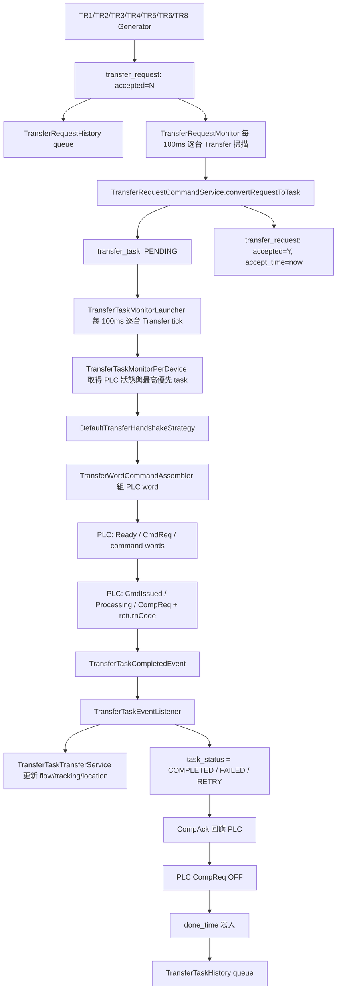

# TransferRequest 完整生命週期規格

## 目的

本文件整理 `TransferRequest` 從產生、轉換為 `TransferTask`、送往 PLC、接收完成回報、更新庫位資料、寫入歷史資料，直到最終結束的完整資料流。

Transfer 的生命週期有三個容易混淆的節點：

- `transfer_request.accepted = Y`：只代表 request 已轉成 task。
- `transfer_task.task_status = COMPLETED / FAILED`：代表 PLC completion return code 已被事件處理。
- `transfer_task.done_time IS NOT NULL`：代表 handshake 已完成收尾，該 task 才真正離開 monitor 追蹤範圍。

## 總覽流程



## 1. Request 產生來源

主要介面：

- `src/main/java/com/czkuo/rdf88701/application/generator/TransferRequestGenerator.java`

實作檔案：

- `src/main/java/com/czkuo/rdf88701/application/generator/impl/transfer/TR1RequestGenerator.java`
- `src/main/java/com/czkuo/rdf88701/application/generator/impl/transfer/TR2RequestGenerator.java`
- `src/main/java/com/czkuo/rdf88701/application/generator/impl/transfer/TR3RequestGenerator.java`
- `src/main/java/com/czkuo/rdf88701/application/generator/impl/transfer/TR4RequestGenerator.java`
- `src/main/java/com/czkuo/rdf88701/application/generator/impl/transfer/TR5RequestGenerator.java`
- `src/main/java/com/czkuo/rdf88701/application/generator/impl/transfer/TR6RequestGenerator.java`
- `src/main/java/com/czkuo/rdf88701/application/generator/impl/transfer/TR8RequestGenerator.java`

目前沒有看到 `TR7RequestGenerator`。

Generator 共同原則：

- 一次只允許同一台 Transfer 存在未完成 request 或 task。
- 產生前會檢查 `existsUnfinishedRequestForDevice(transferId)`。
- 產生前會檢查 `existsUnfinishedTaskForTransfer(transferId)`。
- 依現場條件決定是否建立 `MOVE`、`PICK`、`DROP`。
- 若條件不足，回傳 `Optional.empty()`，不建立 request。

## 2. Generator 排程入口

一般 Transfer 由：

- `src/main/java/com/czkuo/rdf88701/application/monitor/TransferMonitorLauncher.java`

排程行為：

- 啟動時讀取所有 `transfer`。
- 依 `TR{id}` 從 Spring `generatorMap` 取得 generator。
- 每台 Transfer 使用 `scheduleWithFixedDelay(..., 100ms)`。
- 用 `runningFlags` 避免同台 Transfer 同一時間重入。
- 送入 `MonitorPoolDispatcher` 執行。
- 若 `transfer.enabled != true` 則跳過。

特殊排程：

- `TR2`、`TR4`、`TR5` 不走一般 `TransferMonitorLauncher`。
- 這三台由 `src/main/java/com/czkuo/rdf88701/application/monitor/DualGroupOrchestrator.java` 控制。

`DualGroupOrchestrator` 目前相關 group：

- Group D：每 100ms 執行 `TR2` 與 `WB1`。
- Group E：每 200ms 執行 `TR4`。
- Group F：每 200ms 執行 `TR5`。

目的：

- 將部分 Transfer、WorkingBeam、Gripper 的產生時機放在同一個 orchestration 層。
- 以 group running flag 防止同一 group 重入。
- 以 in-memory lock 預留互斥控制點。

## 3. Request 建立與驗證

主要服務：

- `src/main/java/com/czkuo/rdf88701/application/service/command/TransferRequestCommandService.java`
- `src/main/java/com/czkuo/rdf88701/domain/factory/TransferRequestFactory.java`
- `src/main/java/com/czkuo/rdf88701/domain/service/TransferRequestDomainService.java`

建立流程：

1. Generator 組出 `TransferRequestCreateCommand`。
2. `TransferRequestCommandService.create()` 依 `requestKey` 查詢是否已存在。
3. 若已存在且尚未 accepted/rejected，走 `upgradeFrom()` 增加 version。
4. 若不存在，走 `TransferRequestFactory.create()`。
5. `validateForCreation()` 檢查必要欄位與 requestKey 重複。
6. 寫入 `transfer_request`。
7. repository 將 INSERT 事件放入 `TransferRequestHistoryInsertService` queue。

`transfer_request` 重要欄位：

- `request_key`：唯一鍵。
- `request_source`：`UI` 或 `SYSTEM`。
- `transfer_id`：目標 Transfer。
- `task_type`：`MOVE`、`PICK`、`DROP`。
- `container_main_id`：容器主檔，部分情境可為 null。
- `source_location_id` / `target_location_id`：來源與目的庫位。
- `accepted`：預設 `N`。
- `accept_time`：轉成 task 時寫入。
- `raw_payload`：可保留原始上下文。

## 4. Request 轉 Task

排程入口：

- `src/main/java/com/czkuo/rdf88701/application/monitor/TransferRequestMonitor.java`

服務：

- `src/main/java/com/czkuo/rdf88701/application/service/TransferRequestMonitorService.java`
- `src/main/java/com/czkuo/rdf88701/application/service/command/TransferRequestCommandService.java`
- `src/main/java/com/czkuo/rdf88701/domain/factory/TransferTaskFactory.java`

流程：

1. `TransferRequestMonitor` 每 100ms 讀取所有 Transfer id。
2. 每台 Transfer 丟入 dispatcher。
3. `monitorUnacceptedRequestsByDevice(String transferId)` 查詢該 Transfer 第一筆 `accepted = 'N'` request。
4. `convertRequestToTask(requestId, transferId)` 重新讀取 request。
5. `validateForConvertToTask()` 確認 request 尚未 accepted 且未 rejected。
6. `TransferTaskFactory.createFromRequest()` 建立 task。
7. 寫入 `transfer_task`，狀態為 `PENDING`。
8. `request.markAsAccepted()`，將 request 設為 `accepted = 'Y'` 並寫入 `accept_time`。
9. request/task 更新都會進入 history queue。

`TransferTaskFactory.createFromRequest()` 欄位對應：

- `request.id` -> `task.request_id`
- `request.transfer_id` -> `task.transfer_id`
- `request.task_type` -> `task.task_type`
- `request.container_main_id` -> `task.container_main_id`
- `request.source_location_id` -> `task.from_location_id`
- `request.target_location_id` -> `task.to_location_id`
- `task_status = PENDING`
- `priority_level = 0`

## 5. Task 查詢與執行入口

排程入口：

- `src/main/java/com/czkuo/rdf88701/application/monitor/TransferTaskMonitorLauncher.java`
- `src/main/java/com/czkuo/rdf88701/application/monitor/TransferTaskMonitorPerDevice.java`

查詢服務：

- `src/main/java/com/czkuo/rdf88701/application/service/query/TransferTaskQueryService.java`
- `src/main/java/com/czkuo/rdf88701/infra/repository/impl/TransferTaskRepositoryImpl.java`
- `src/main/resources/mapper/TransferTaskMapper.xml`

排程行為：

- 每台 Transfer 每 100ms tick。
- 用 `runningFlags` 防止同台 Transfer 重入。
- 實際執行送入 `MonitorPoolDispatcher`。

Task 選取條件：

```sql
WHERE transfer_id = #{transferId}
  AND task_status IN ('PENDING', 'DISPATCHED', 'IN_PROGRESS', 'RETRY', 'COMPLETED', 'FAILED')
  AND done_time IS NULL
ORDER BY
  CASE task_status
    WHEN 'PENDING' THEN 0
    WHEN 'DISPATCHED' THEN 1
    WHEN 'IN_PROGRESS' THEN 2
    WHEN 'RETRY' THEN 3
    WHEN 'COMPLETED' THEN 4
    WHEN 'FAILED' THEN 5
    ELSE 99
  END,
  priority_level DESC,
  id ASC
LIMIT 1
```

關鍵判斷：

- `COMPLETED` / `FAILED` 仍可能被查到，只要 `done_time IS NULL`。
- 這是為了讓 handshake 做 completion ack 收尾。
- 真正結束依據是 `done_time IS NOT NULL`。

若沒有 task，但 command cache 顯示 `TransferCmdReq = ON`：

- monitor 會將 `CmdReq` 關閉。
- 送一次 `CompAck` true/false。
- 用於清掉殘留 PLC command 狀態。

## 6. PLC Command 組裝

主要檔案：

- `src/main/java/com/czkuo/rdf88701/application/assembler/TransferWordCommandAssembler.java`

輸出：

- `PlcTransferWordCommand.transferNo = transfer_task.id`
- `transferType`：
  - `MOVE` -> `1`
  - `PICK` -> `2`
  - `DROP` -> `3`
- `locationLevel`：
  - `PICK` 使用 `from_location_id`
  - `DROP` / `MOVE` 使用 `to_location_id`
  - 從 `location_point.code` 解析整數，解析失敗為 `0`
- `productId`：
  - TR6 使用 `containerCode`，若空才用 `aliasCode`
  - 其他 TR 使用 `aliasCode`

若 task type 不支援或找不到 location，會丟出 `IllegalArgumentException`，本輪 handshake 失敗並由 monitor log error。

## 7. PLC Handshake

主要檔案：

- `src/main/java/com/czkuo/rdf88701/application/service/command/TransferHandshakeStateMachine.java`
- `src/main/java/com/czkuo/rdf88701/application/service/command/DefaultTransferHandshakeStrategy.java`
- `src/main/java/com/czkuo/rdf88701/domain/repository/TransferHandshakeContextRepository.java`

狀態階段：

- `NONE`
- `CMD_SENT`
- `ACK_RECEIVED`
- `CMD_REQ_CLEARED`
- `IN_PROGRESS`
- `COMPLETION_RECEIVED`
- `RESPONDED_COMPLETION`
- `COMPLETION_CONFIRMED`
- `DONE`
- `FAILED`

主要轉移：

1. 每次 tick 先寫 `TransferReady = true`。
2. `NONE` 階段若無 PLC 既有狀態，組 word 並寫入 PLC，然後 `CmdReq = true`。
3. command 送出後 task 標 `DISPATCHED`。
4. PLC `CmdIssued` 後關閉 `CmdReq`。
5. 進入 `IN_PROGRESS` 時 task 標 `IN_PROGRESS`。
6. PLC `CompReq` 後讀取 return code。
7. 發出 `TransferTaskCompletedEvent`。
8. 寫 `CompAck = true`。
9. PLC `CompReq` 關閉後，將 `CompAck = false`。
10. 若 task 已是 terminal 狀態，寫入 `done_time`。
11. phase 進入 `DONE`。

timeout 行為：

- `CMD_SENT` 超過 30 秒未 ack：關閉 `CmdReq`，phase 回 `NONE`。
- `IN_PROGRESS` 超過 300 秒未 completion：關閉 `CmdReq` / `CompAck`，phase 回 `NONE`。

特殊恢復：

- 若系統重啟或 context 消失，但 PLC 顯示 Processing 且 command transferNo 等於 task id，會恢復到 `IN_PROGRESS` 或 `RESPONDED_COMPLETION`。
- 若 PLC 有 CompletionReq，會直接補 `CompAck` 並進入收尾。

## 8. Completion Event 與結果處理

事件：

- `src/main/java/com/czkuo/rdf88701/infra/event/model/plc/transfer/TransferTaskCompletedEvent.java`

Listener：

- `src/main/java/com/czkuo/rdf88701/application/listener/TransferTaskEventListener.java`

return code 對應：

- `0x100`：成功，更新 flow/tracking/location，task 標 `COMPLETED`。
- `0x800`：Transfer 中斷，task 標 `FAILED`。
- `0xF00`：Transfer 異常，task 標 `FAILED`。
- 其他：task 標 `RETRY`。

注意：

- `RETRY` 不是 terminal 狀態。
- `COMPLETION_CONFIRMED` 階段遇到 `RETRY` 不會寫 `done_time`，而是回到 `NONE` 等下一輪重送。

## 9. 成功後資料更新

主要檔案：

- `src/main/java/com/czkuo/rdf88701/application/service/transfer/TransferTaskTransferService.java`

成功時會呼叫：

- `updateFlowAndTrackingOnSuccess(task)`
- `markTaskCompleted(task)`

依 task type 行為：

### MOVE

目前不更新 flow/tracking。

用途上偏向 Transfer 自身移動，不視為容器位置變更。

### PICK

代表容器從原位置被 Transfer 拿起。

處理內容：

1. `markPreviousAsLeft(containerId, taskId)`：
   - 將舊 `location_flow` 標記 left。
   - 依 `location_tracking` 找到舊位置。
   - 將舊 `location_point` 標 vacant。
2. 解析 Transfer 暫存位置：
   - location name = `Transfer#<transferId>`
   - 透過 `TransferServiceLocationCache` 快取查找。
3. `markArrived(containerId, transferSiteId, taskId)`：
   - 新增 `location_flow`。
   - 更新或新增 `location_tracking`。
   - 將 Transfer 暫存位置 `location_point` 標 occupied。

### DROP

代表容器從 Transfer 放到目標位置。

處理內容：

1. `markPreviousAsLeft(containerId, taskId)`：
   - 將 Transfer 暫存位置 flow 標 left。
   - 將 Transfer 暫存位置標 vacant。
2. `markArrived(containerId, toLocationId, taskId)`：
   - 新增到目標位置的 `location_flow`。
   - 更新或新增 `location_tracking`。
   - 將目標 `location_point` 標 occupied。

## 10. History 生命週期

相關檔案：

- `src/main/java/com/czkuo/rdf88701/application/service/History/GenericHistoryInsertService.java`
- `src/main/java/com/czkuo/rdf88701/application/service/History/TransferRequestHistoryInsertService.java`
- `src/main/java/com/czkuo/rdf88701/application/service/History/TransferTaskHistoryInsertService.java`
- `src/main/java/com/czkuo/rdf88701/application/monitor/History/HistoryFlushMonitor.java`

觸發點：

- `TransferRequestRepositoryImpl.save/update/deleteById`
- `TransferTaskRepositoryImpl.save/update/deleteById/updateTaskStatus/markTaskAsDone`

處理方式：

- repository 不直接 insert history table。
- 先將 entity 與 changeType 放入 `ConcurrentLinkedQueue`。
- `HistoryFlushMonitor` 每 20 秒 flush。
- 每類一次 poll 50 筆。
- 目前 `TransferRequestHistory` 與 `TransferTaskHistory` 使用逐筆 insert。

實作注意：

- `HistoryFlushMonitor` 中 TransferRequest 的 flush name 目前寫成 `"GripperRequestHistory"`，但實際 mapper 是 `transferRequestHistoryMapper`。這只影響 log 名稱，不影響資料寫入目標。

## 11. 資料表與索引

DDL：

- `DDL/rdf887_01/transfer_request.sql`
- `DDL/rdf887_01/transfer_task.sql`
- `DDL/rdf887_01/transfer_request_history.sql`
- `DDL/rdf887_01/transfer_task_history.sql`

`transfer_request` 主要索引：

- `uk_request_key`：避免重複 request key。
- `IDX_transfer_request_transfer_id_accepted_created_time`：
  - 支援每台 Transfer 找第一筆未 accepted request。
- `IDX_transfer_request_created_time`
- `idx_container_main_id`

`transfer_task` 主要索引：

- `IDX_transfer_task_transfer_id_task_status_done_time`：
  - 支援每台 Transfer 查未 done task。
- `IDX_transfer_task_transfer_id_from_location_id_to_location_id`
- `idx_container_id_created_time`
- `idx_container_main_id`
- `idx_request_id`

## 12. 結束條件判定

TransferRequest：

- 產生後：`accepted = N`
- 轉成 task 後：`accepted = Y`
- 轉成 task 不代表 PLC 已執行。

TransferTask：

- 建立後：`PENDING`
- command 送出：`DISPATCHED`
- PLC 已接手：`IN_PROGRESS`
- return code 成功：`COMPLETED`
- return code 失敗：`FAILED`
- return code 未知：`RETRY`
- handshake 完整收尾：`done_time IS NOT NULL`

完整完成定義：

- 對業務資料而言：`task_status = COMPLETED` 且 flow/tracking/location 已更新。
- 對 PLC handshake 而言：`done_time IS NOT NULL`。
- 對 monitor 查詢而言：`done_time IS NOT NULL` 後才不再被選取。

## 13. 追蹤與除錯建議

若要追一筆 TransferRequest：

1. 先用 `request_key` 找 `transfer_request`。
2. 看 `accepted` 與 `accept_time`，確認是否已轉 task。
3. 用 `transfer_task.request_id = transfer_request.id` 找 task。
4. 看 `task_status`：
   - `PENDING`：尚未送 PLC。
   - `DISPATCHED`：已送 command，等待 PLC ack。
   - `IN_PROGRESS`：PLC 已處理中。
   - `COMPLETED` / `FAILED`：completion event 已處理，等待或已完成 handshake 收尾。
   - `RETRY`：return code 未知，下一輪會重送。
5. 看 `done_time`：
   - null：monitor 還會繼續追。
   - 非 null：該 task 對 monitor 已結束。
6. 成功 PICK/DROP 時，追：
   - `location_flow.source_task_id = transfer_task.id`
   - `location_tracking.container_main_id`
   - `location_point.is_occupied`
7. 若要看歷史，追：
   - `transfer_request_history.origin_id`
   - `transfer_task_history.origin_id`

