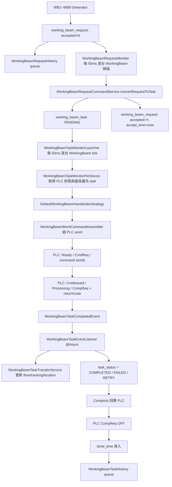

# WorkingBeamRequest 完整生命週期規格

## 目的

本文件整理 `WorkingBeamRequest` 從產生、轉換為 `WorkingBeamTask`、送往 PLC、接收完成事件、更新輸送帶控制範圍內的庫位資料、寫入歷史資料，直到最終結束的完整資料流。

WorkingBeam 的 request/task 比 Transfer、Gripper 單純，核心欄位是：

- `working_beam_id`：指定哪一台 WorkingBeam。
- `direction`：`IN` 或 `OUT`，送 PLC 時會轉成方向碼。

但完成後的資料更新較特殊：它不從 request/task 帶 container/location，而是依 `working_beam_control_range.position_order`，把該 WorkingBeam 控制範圍內的容器往下一個位置推移。

## 總覽流程



## 1. Request 產生來源

主要介面：

- `src/main/java/com/czkuo/rdf88701/application/generator/WorkingBeamRequestGenerator.java`

實作檔案：

- `src/main/java/com/czkuo/rdf88701/application/generator/impl/workingbeam/WB1RequestGenerator.java`
- `src/main/java/com/czkuo/rdf88701/application/generator/impl/workingbeam/WB2RequestGenerator.java`
- `src/main/java/com/czkuo/rdf88701/application/generator/impl/workingbeam/WB3RequestGenerator.java`
- `src/main/java/com/czkuo/rdf88701/application/generator/impl/workingbeam/WB4RequestGenerator.java`
- `src/main/java/com/czkuo/rdf88701/application/generator/impl/workingbeam/WB5RequestGenerator.java`
- `src/main/java/com/czkuo/rdf88701/application/generator/impl/workingbeam/WB6RequestGenerator.java`
- `src/main/java/com/czkuo/rdf88701/application/generator/impl/workingbeam/WB7RequestGenerator.java`
- `src/main/java/com/czkuo/rdf88701/application/generator/impl/workingbeam/WB8RequestGenerator.java`

Generator 共同原則：

- 同一台 WorkingBeam 若已有未完成 request/task，通常不再產生新 request。
- 產生前會檢查 `existsUnfinishedRequestForBeam(workingBeamId)`。
- 產生前會檢查 `existsUnfinishedTaskForBeam(workingBeamId)`。
- 依現場條件、前後段設備狀態、站點 occupancy、相關 Gripper/Transfer 是否忙碌，決定是否產生 request。
- 產生成功回傳 request id；條件不足回傳 `Optional.empty()`。

## 2. Generator 排程入口

一般 WorkingBeam 由：

- `src/main/java/com/czkuo/rdf88701/application/monitor/WorkingBeamMonitorLauncher.java`

排程行為：

- 啟動時讀取所有 `working_beam`。
- 依 `WB{id}` 從 Spring `generatorMap` 取得 generator。
- 每台 WorkingBeam 使用 `scheduleWithFixedDelay(..., 50ms)`。
- 用 `runningFlags` 避免同台 WorkingBeam 同一時間重入。
- 送入 `MonitorPoolDispatcher` 執行。
- 若 `working_beam.enabled != true` 則跳過。

特殊排程：

- `WB1`、`WB5`、`WB6`、`WB7`、`WB8` 不走一般 `WorkingBeamMonitorLauncher`。
- 這幾台由 `src/main/java/com/czkuo/rdf88701/application/monitor/DualGroupOrchestrator.java` 控制。

`DualGroupOrchestrator` 目前相關 group：

- Group A：每 50ms 執行 `GP4`、`WB5`、`WB8`。
- Group B：每 50ms 執行 `GP5`、`WB6`。
- Group C：每 100ms 執行 `GP2`、`WB7`。
- Group D：每 100ms 執行 `TR2`、`WB1`。

`WB3`、`WB4` 在 orchestrator 中目前是註解狀態，因此仍由一般 launcher 管理。

## 3. Request 建立與驗證

主要服務：

- `src/main/java/com/czkuo/rdf88701/application/service/command/WorkingBeamRequestCommandService.java`
- `src/main/java/com/czkuo/rdf88701/domain/factory/WorkingBeamRequestFactory.java`
- `src/main/java/com/czkuo/rdf88701/domain/service/WorkingBeamRequestDomainService.java`

建立流程：

1. Generator 組出 `WorkingBeamRequestCreateCommand`。
2. `WorkingBeamRequestCommandService.create()` 依 `requestKey` 查詢是否已存在。
3. 若已存在且尚未 accepted/rejected，走 `upgradeFrom()` 增加 version。
4. 若不存在，走 `WorkingBeamRequestFactory.create()`。
5. `validateForCreation()` 檢查必要欄位與 requestKey 重複。
6. 寫入 `working_beam_request`。
7. repository 將 INSERT 事件放入 `WorkingBeamRequestHistoryInsertService` queue。

`working_beam_request` 重要欄位：

- `request_key`：唯一鍵。
- `request_source`：`UI` 或 `SYSTEM`。
- `working_beam_id`：目標 WorkingBeam。
- `direction`：`IN` 或 `OUT`。
- `accepted`：預設 `N`。
- `accept_time`：轉成 task 時寫入。
- `raw_payload`：可保留原始上下文。

驗證重點：

- `requestKey` 不可空。
- `direction` 不可空。
- `requestKey` 不可重複。
- 已 accepted 或 rejected 的舊 request 不允許 upgrade。

## 4. Request 轉 Task

排程入口：

- `src/main/java/com/czkuo/rdf88701/application/monitor/WorkingBeamRequestMonitor.java`

服務：

- `src/main/java/com/czkuo/rdf88701/application/service/WorkingBeamRequestMonitorService.java`
- `src/main/java/com/czkuo/rdf88701/application/service/command/WorkingBeamRequestCommandService.java`
- `src/main/java/com/czkuo/rdf88701/domain/factory/WorkingBeamTaskFactory.java`

流程：

1. `WorkingBeamRequestMonitor` 每 50ms 讀取所有 WorkingBeam id。
2. 每台 WorkingBeam 丟入 dispatcher。
3. `monitorUnacceptedRequestsByDevice(String workingBeamId)` 查詢該 WorkingBeam 第一筆 `accepted = 'N'` request。
4. `convertRequestToTask(requestId, workingBeamId)` 重新讀取 request。
5. `validateForConvertToTask()` 確認 request 尚未 accepted 且未 rejected。
6. `WorkingBeamTaskFactory.createFromRequest()` 建立 task。
7. 寫入 `working_beam_task`，狀態為 `PENDING`。
8. `request.markAsAccepted()`，將 request 設為 `accepted = 'Y'` 並寫入 `accept_time`。
9. request/task 更新都會進入 history queue。

`WorkingBeamTaskFactory.createFromRequest()` 欄位對應：

- `request.id` -> `task.request_id`
- `request.working_beam_id` -> `task.working_beam_id`
- `request.direction` -> `task.direction`
- `task_status = PENDING`
- `priority_level = 0`

## 5. Task 查詢與執行入口

排程入口：

- `src/main/java/com/czkuo/rdf88701/application/monitor/WorkingBeamTaskMonitorLauncher.java`
- `src/main/java/com/czkuo/rdf88701/application/monitor/WorkingBeamTaskMonitorPerDevice.java`

查詢服務：

- `src/main/java/com/czkuo/rdf88701/application/service/query/WorkingBeamTaskQueryService.java`
- `src/main/java/com/czkuo/rdf88701/infra/repository/impl/WorkingBeamTaskRepositoryImpl.java`
- `src/main/resources/mapper/WorkingBeamTaskMapper.xml`

排程行為：

- 每台 WorkingBeam 每 50ms tick。
- 用 `runningFlags` 防止同台 WorkingBeam 重入。
- 實際執行送入 `MonitorPoolDispatcher`。
- 若 `WorkingBeamStatusCache` 沒有有效且完整的 PLC snapshot，直接跳過。

Task 選取條件：

```sql
WHERE working_beam_id = #{workingBeamId}
  AND task_status IN ('PENDING', 'DISPATCHED', 'IN_PROGRESS', 'RETRY', 'COMPLETED', 'FAILED')
  AND done_time IS NULL
ORDER BY
  CASE task_status
    WHEN 'PENDING' THEN 0
    WHEN 'DISPATCHED' THEN 1
    WHEN 'IN_PROGRESS' THEN 2
    WHEN 'RETRY' THEN 3
    WHEN 'COMPLETED' THEN 4
    WHEN 'FAILED' THEN 5
    ELSE 99
  END,
  priority_level DESC,
  id ASC
LIMIT 1
```

關鍵判斷：

- `COMPLETED` / `FAILED` 仍可能被查到，只要 `done_time IS NULL`。
- 這是為了讓 handshake 做 completion ack 收尾。
- 真正結束依據是 `done_time IS NOT NULL`。

## 6. PLC Command 組裝

主要檔案：

- `src/main/java/com/czkuo/rdf88701/application/assembler/WorkingBeamWordCommandAssembler.java`

輸出：

- `transferNo = working_beam_task.id`
- `transferType = 1`
- `direction`：
  - `IN` -> `1`
  - `OUT` -> `2`

若 direction 不是 `IN` 或 `OUT`，會丟出 `IllegalArgumentException`，本輪 handshake 失敗並由 monitor log error。

## 7. PLC Handshake

主要檔案：

- `src/main/java/com/czkuo/rdf88701/application/service/command/WorkingBeamHandshakeStateMachine.java`
- `src/main/java/com/czkuo/rdf88701/application/service/command/DefaultWorkingBeamHandshakeStrategy.java`
- `src/main/java/com/czkuo/rdf88701/domain/repository/WorkingBeamHandshakeContextRepository.java`

狀態階段：

- `NONE`
- `CMD_SENT`
- `ACK_RECEIVED`
- `CMD_REQ_CLEARED`
- `IN_PROGRESS`
- `COMPLETION_RECEIVED`
- `RESPONDED_COMPLETION`
- `COMPLETION_CONFIRMED`
- `DONE`
- `FAILED`

主要轉移：

1. 每次 tick 先寫 `TransferReady = true`。
2. `NONE` 階段若無 PLC 既有狀態，組 word 並寫入 PLC，然後 `CmdReq = true`。
3. command 送出後 task 標 `DISPATCHED`。
4. PLC `CmdIssued` 後關閉 `CmdReq`。
5. 進入 `IN_PROGRESS` 時 task 標 `IN_PROGRESS`。
6. PLC `CompReq` 後讀取 return code。
7. 發出 `WorkingBeamTaskCompletedEvent`。
8. 寫 `CompAck = true`。
9. PLC `CompReq` 關閉後，將 `CompAck = false`。
10. 若 task 已是 terminal 狀態，寫入 `done_time`。
11. phase 進入 `DONE`。

timeout 行為：

- `CMD_SENT` 超過 30 秒未 ack：關閉 `CmdReq`，phase 回 `NONE`。
- `IN_PROGRESS` 超過 30 秒未 completion：關閉 `CmdReq` / `CompAck`，phase 回 `NONE`。

特殊恢復：

- 若系統重啟或 context 消失，但 PLC 顯示 Processing 且 command transferNo 等於 task id，會恢復到 `IN_PROGRESS` 或 `RESPONDED_COMPLETION`。
- 若 PLC 有 CompletionReq，會直接補 `CompAck` 並進入收尾。

## 8. Completion Event 與結果處理

事件：

- `src/main/java/com/czkuo/rdf88701/infra/event/model/plc/workingbeam/WorkingBeamTaskCompletedEvent.java`

Listener：

- `src/main/java/com/czkuo/rdf88701/application/listener/WorkingBeamTaskEventListener.java`

特性：

- listener 使用 `@Async`。
- completion event 發出後，handshake 會繼續送 `CompAck`，事件處理與 handshake 收尾不是同一條同步執行鏈。

return code 對應：

- `0x100`：成功，更新 flow/tracking/location，task 標 `COMPLETED`。
- `0x800`：WorkingBeam 中斷，task 標 `FAILED`。
- `0xF00`：WorkingBeam 異常，task 標 `FAILED`。
- 其他：task 標 `RETRY`。

注意：

- `RETRY` 不是 terminal 狀態。
- `COMPLETION_CONFIRMED` 階段遇到 `RETRY` 不會寫 `done_time`，而是回到 `NONE` 等下一輪重送。

## 9. 成功後資料更新

主要檔案：

- `src/main/java/com/czkuo/rdf88701/application/service/transfer/WorkingBeamTaskTransferService.java`

成功時會呼叫：

- `updateFlowAndTrackingOnSuccess(task)`
- `markTaskCompleted(task)`

資料來源：

- `working_beam_control_range`
- `location_tracking`
- `location_flow`
- `location_point`

控制範圍表：

- `DDL/rdf887_01/working_beam_control_range.sql`

重要欄位：

- `working_beam_id`
- `location_point_id`
- `position_order`
- `(working_beam_id, location_point_id)` unique

更新流程：

1. 用 `working_beam_id` 查出控制範圍，依 `position_order ASC` 排序。
2. 用 `locationTrackingRepository.findContainersByWorkingBeamId(beamId)` 查出該 WorkingBeam 範圍內的 tracking。
3. 轉成 `locationPointId -> LocationTracking` map。
4. 若 control range 少於 2 個位置，記 log 後不更新 flow/tracking。
5. 從 `ranges.size() - 2` 往 `0` 倒序掃描。
6. 每個有 container tracking 的位置，呼叫 `moveContainer()`。

`moveContainer()` 行為：

1. `fromLocId = ranges[i].locationPointId`
2. `toLocId = ranges[i + 1].locationPointId`
3. 取得 container id。
4. `location_flow` 舊紀錄標 left。
5. 新增一筆 `location_flow`：
   - `container_main_id = containerId`
   - `location_point_id = toLocId`
   - `arrived_time = now`
   - `entry_type = PLC`
   - `source_task_id = taskId`
6. 更新 `location_tracking` 到 `toLocId` 與新 flow id。
7. `location_point.markVacant(fromLocId)`。
8. `location_point.markOccupied(toLocId)`。

倒序掃描的意義：

- 若同一 WorkingBeam 上有多個容器，先移動後段，再移動前段。
- 可避免前段容器移到後段時，覆蓋同一輪尚未處理的後段 tracking。

目前 direction 對 flow/tracking 更新的影響：

- `direction` 會送給 PLC。
- 成功後的資料更新目前固定依 `position_order` 往下一格移動。
- 程式中未依 `IN` / `OUT` 改變 ranges 掃描方向。

## 10. History 生命週期

相關檔案：

- `src/main/java/com/czkuo/rdf88701/application/service/History/GenericHistoryInsertService.java`
- `src/main/java/com/czkuo/rdf88701/application/service/History/WorkingBeamRequestHistoryInsertService.java`
- `src/main/java/com/czkuo/rdf88701/application/service/History/WorkingBeamTaskHistoryInsertService.java`
- `src/main/java/com/czkuo/rdf88701/application/monitor/History/HistoryFlushMonitor.java`

觸發點：

- `WorkingBeamRequestRepositoryImpl.save/update/deleteById`
- `WorkingBeamTaskRepositoryImpl.save/update/deleteById/updateTaskStatus/markTaskAsDone`

處理方式：

- repository 不直接 insert history table。
- 先將 entity 與 changeType 放入 `ConcurrentLinkedQueue`。
- `HistoryFlushMonitor` 每 20 秒 flush。
- 每類一次 poll 50 筆。
- 目前 `WorkingBeamRequestHistory` 與 `WorkingBeamTaskHistory` 使用逐筆 insert。

## 11. 資料表與索引

DDL：

- `DDL/rdf887_01/working_beam_request.sql`
- `DDL/rdf887_01/working_beam_task.sql`
- `DDL/rdf887_01/working_beam_request_history.sql`
- `DDL/rdf887_01/working_beam_task_history.sql`
- `DDL/rdf887_01/working_beam_control_range.sql`

`working_beam_request` 主要索引：

- `uk_request_key`：避免重複 request key。
- `IDX_working_beam_request_accepted_created_time`
- `IDX_working_beam_request_created_time`
- `idx_working_beam_id`

`working_beam_task` 主要索引：

- `IDX_working_beam_task_working_beam_id_task_status_created_time`
- `IDX_working_beam_task_request_id_created_time`
- `IDX_working_beam_task_created_time`

目前 task monitor 查詢條件包含：

- `working_beam_id`
- `task_status`
- `done_time IS NULL`

DDL 現有索引未包含 `done_time`，但查詢仍可先利用 `(working_beam_id, task_status, created_time)` 篩選，再判斷 done_time。

## 12. 結束條件判定

WorkingBeamRequest：

- 產生後：`accepted = N`
- 轉成 task 後：`accepted = Y`
- 轉成 task 不代表 PLC 已執行。

WorkingBeamTask：

- 建立後：`PENDING`
- command 送出：`DISPATCHED`
- PLC 已接手：`IN_PROGRESS`
- return code 成功：`COMPLETED`
- return code 失敗：`FAILED`
- return code 未知：`RETRY`
- handshake 完整收尾：`done_time IS NOT NULL`

完整完成定義：

- 對業務資料而言：`task_status = COMPLETED` 且 flow/tracking/location 已更新。
- 對 PLC handshake 而言：`done_time IS NOT NULL`。
- 對 monitor 查詢而言：`done_time IS NOT NULL` 後才不再被選取。

## 13. 追蹤與除錯建議

若要追一筆 WorkingBeamRequest：

1. 先用 `request_key` 找 `working_beam_request`。
2. 看 `accepted` 與 `accept_time`，確認是否已轉 task。
3. 用 `working_beam_task.request_id = working_beam_request.id` 找 task。
4. 看 `task_status`：
   - `PENDING`：尚未送 PLC。
   - `DISPATCHED`：已送 command，等待 PLC ack。
   - `IN_PROGRESS`：PLC 已處理中。
   - `COMPLETED` / `FAILED`：completion event 已處理，等待或已完成 handshake 收尾。
   - `RETRY`：return code 未知，下一輪會重送。
5. 看 `done_time`：
   - null：monitor 還會繼續追。
   - 非 null：該 task 對 monitor 已結束。
6. 成功時追控制範圍：
   - `working_beam_control_range.working_beam_id`
   - `working_beam_control_range.position_order`
7. 成功後追位置資料：
   - `location_flow.source_task_id = working_beam_task.id`
   - `location_tracking.container_main_id`
   - `location_point.is_occupied`
8. 若要看歷史，追：
   - `working_beam_request_history.origin_id`
   - `working_beam_task_history.origin_id`

## 14. 已知觀察點

- `WorkingBeamTaskEventListener` 是非同步事件處理，若 async executor 壅塞，`task_status` 更新可能晚於 handshake 的 `CompAck` 收尾節奏。
- 成功後資料更新目前固定依 `position_order` 往下一格移動，未依 `direction` 反向處理。
- `WorkingBeamTaskMapper.xml` 內有一段 `findTopTaskByTransferOrdered` 查詢 `transfer_task`，看起來不是 WorkingBeam 主流程會使用的查詢；主流程使用的是 `findTopTaskByWorkingBeamOrdered`。
- `working_beam_task` 現有索引未包含 `done_time`，若資料量增大且 completed/failed 未 done 的查詢變多，可評估新增 `(working_beam_id, task_status, done_time)` 類型索引。

